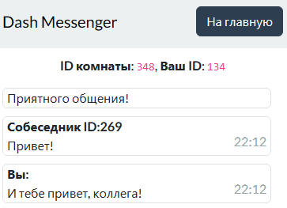

# Changelog

## Запланированные фичи и исправления
- Отправка картинок и стикеров
- Прокрутка чата вниз
- Переделка механики работы чата при прерывании соединения (на данный момент чат очищается и для повторного подключения нужно перезагрузить страницу)

## Выпущенные версии
### [alpha-6] - XX/04/2024
- Темная тема для приложения

### [alpha-5] - 25/04/2024
- Разнесение функций по разным файлам
- Проверка существования комнаты
    - В модалке будет отображена ошибка ввода
    - Если нет доступных комнат - кнопка подключения к комнате будет отключена
- Отображение ошибки при недоступности сервера
- Удаление неиспользуемых импортов

### [alpha-4] - 25/04/2024
- Разный цвет для своих сообщений и сообщений собеседника
- Проверка работоспособности WS-сервера (в случае нарушения соединения - дальнейшее взаимодействие блокируется и *чат очищается*)
- Добавлено отображение участников в комнате
    - При подключении участники будут скрыты, но уже у подключенных участников - новые собеседники отобразятся
    - При отправке сообщения в комнате кол-во участников обновится
- Исправления и нововведения сервера:
    - Поддержка сервисных сообщений
    - Широковещательные сообщения участникам комнаты при подключении/отключении клиентов
    - Сохранение комнат и их участников в словаре

### [alpha-3] - 22/04/2024
- Полный редизайн мессенджера
    - 
    - Отказ от "плавающих" сообщений
    - Сообщения растянуты на всю длину блока
    - Сообщения имеют подсветку при наведении
    - Отображается время посылки сообщения
- Очистка и реструктуризация CSS мессенджера
- Подготовка интерфейса для двух фич
    - Прокрутка сообщений в мессенджере вниз по клику на кнопку
    - Кнопка отправки изображений в чат

### [alpha-2] - 22/04/2024
- Реализация общения через WebSocket
    - Задаете ID комнаты и подключаетесь в нее с нескольких устройств
    - Участники комнаты не отображаются (*пофикшено в alpha-4*)
    - Проверка работоспособности сервера не проводится (*пофикшено в alpha-4*)
- Исправление размеров мобильной версии мессенджера
    - Для этого используется кастомный js-скрипт, проверяющий текущие размеры окна

### [alpha-1] - 22/04/2024
- Переход к использованию CHANGELOG
- Фиксы мобильной версии
    - Блок с сообщениями растягивается на весь экран
    - Убрана тень
    - Убран скролл по странице
- Добавлены кнопки для подключения к существующей комнате, либо для создания новой комнаты
- Добавлен modal для ввода номера комнаты
    - При неправильном вводе - поле ввода будет подсвечено красным.