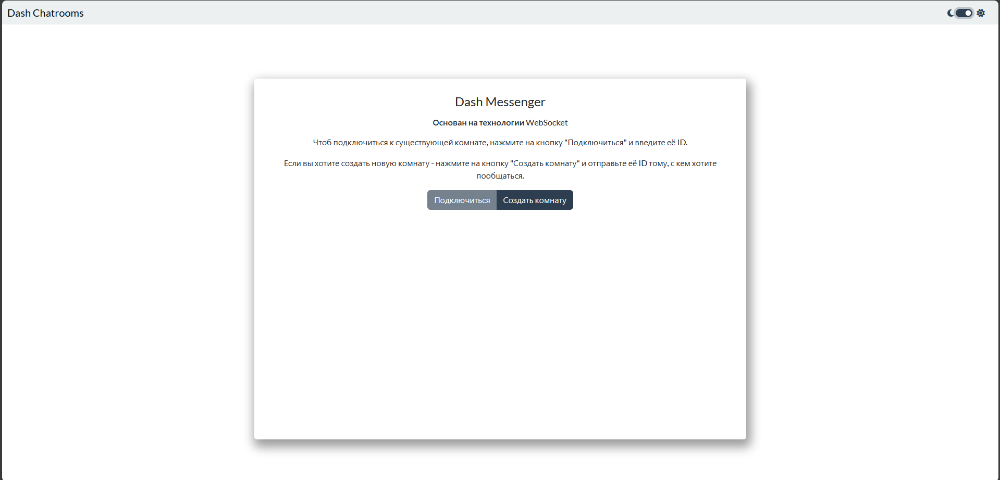
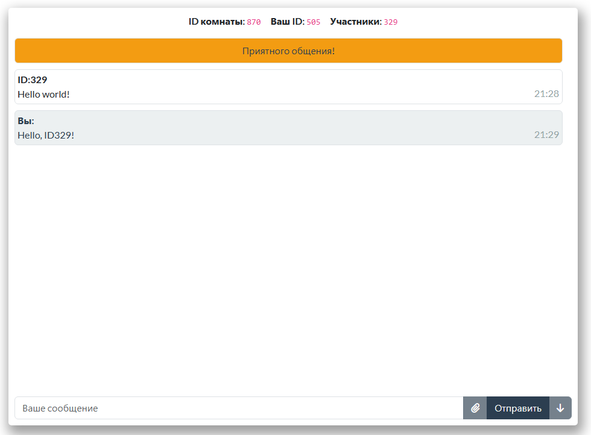
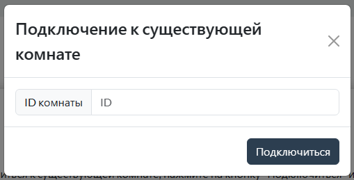
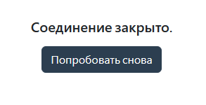

# py_websocket_messenger
Практика в асинхронных и сетевых технологиях. Фронт и бэк на Dash, сервер на Quart.

## Проект закрыт и обновляться не будет.
**Почему?** - причина в самой концепции проекта. Чат-комнаты не очень практичны для общения, поэтому новый проект будет переориентирован в полноценный мессенджер, основанный на Dash и Websocket. Ссылка на новый проект - [клац](https://github.com/MichaelODeli/dash_messenger)

## Скриншоты проекта.
### Главный экран

### Чат

### Модалка для подключения к существующей комнате

### Отображение ошибки подключения

## Запуск и использование.
1. Запустите сервер с сообщениями `python ws_server/server.py`.
2. Запустите сервер Dash `python app.py`.
3. Зайдите в мессенджер, нажмите "Создать комнату" и передайте собеседнику ID Вашей комнаты.
4. Собеседнику нужно нажать на кнопку "Подключение" и ввести ID комнаты.
5. Приятного общения.
